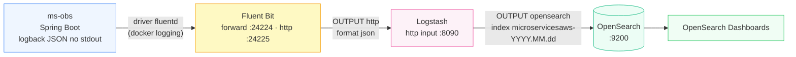
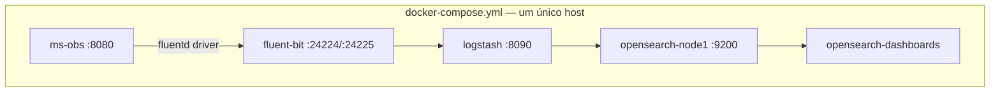
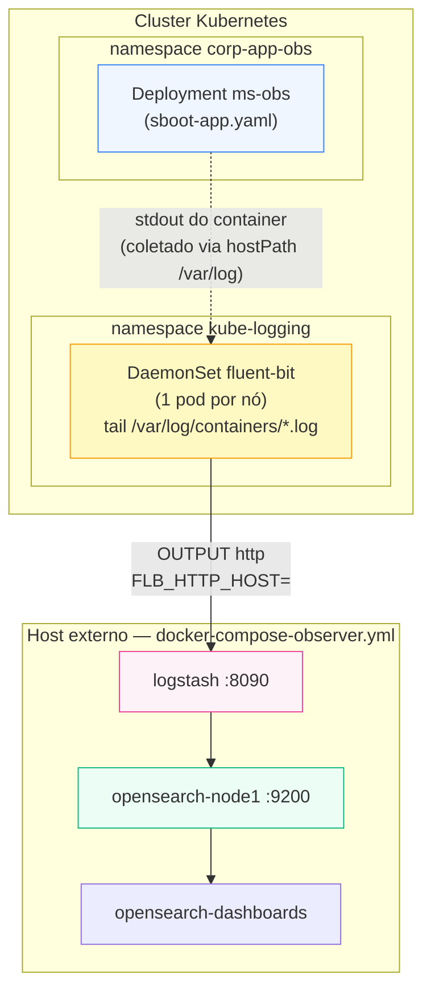

# Arquitetura

## Pipeline de Observabilidade

O `ms-obs` nunca fala diretamente com o Logstash ou o OpenSearch. Ele escreve **logs JSON estruturados no stdout**; a coleta e o encaminhamento são responsabilidade da infraestrutura (driver de log do Docker ou DaemonSet do Fluent Bit no Kubernetes).



> O `ms-obs` **não conhece** Fluent Bit, Logstash ou OpenSearch — a única integração é o `logging.driver: fluentd` configurado no `docker-compose.yml`, que redireciona o stdout do container para o Fluent Bit na porta `24224`.

---

## Duas topologias de execução

### 1. Local — tudo em um único `docker-compose.yml`

Usada para desenvolvimento: todos os componentes sobem juntos na rede `opensearch-net`.



### 2. Híbrida — app + coleta no Kubernetes, observabilidade externa

Os manifests em `kubernetes/` sobem **apenas** o microsserviço (Deployment `ms-obs`) e o Fluent Bit (DaemonSet, um pod por nó). O Fluent Bit é configurado com `FLB_HTTP_HOST` apontando para o **IP do host** onde roda separadamente o `docker-compose-observer.yml` (OpenSearch + Dashboards + Logstash, sem app e sem Fluent Bit).



> O `FLB_HTTP_HOST` é hardcoded como IP (`172.23.53.166` em `infra/`, `172.24.132.180` em `infra-no-pv/`) — não é resolvido por DNS de serviço, então precisa ser atualizado manualmente se o host observer mudar de endereço. Ver [Fluent Bit](fluent-bit).

---

## Por que duas variantes de Fluent Bit no Kubernetes (`infra/` vs. `infra-no-pv/`)

| | `kubernetes/infra/` | `kubernetes/infra-no-pv/` |
|---|---|---|
| Coleta de logs do host | Sim — `INPUT tail` em `/var/log/containers/*.log` + filtro `kubernetes` (enriquece com metadados do pod) | Não — sem `hostPath` de `/var/log` nem `/var/lib/docker/containers` |
| Persistência de posição de leitura | `storage.type filesystem` + `DB /var/log/flb_kube.db` (sobrevive a restart do pod) | Sem armazenamento em disco |
| Uso pretendido | Cluster com volumes persistentes disponíveis (produção/homologação) | Cluster restrito, sem PV disponível (ex.: ambiente de estudo/sandbox) |

Ambas mantêm o mesmo `OUTPUT http` para o Logstash externo. Ver detalhamento completo em [Fluent Bit](fluent-bit).

---

## Estrutura de Pastas

```
observabilidade/
├── ms-obs/                    ← microsserviço Spring Boot (fonte dos logs)
├── fluent-bit/conf/           ← config do Fluent Bit para o docker-compose local
├── logstash/                  ← pipeline + config do Logstash
├── docker-compose.yml         ← stack completa (app + coleta + observabilidade)
├── docker-compose-observer.yml← apenas observabilidade (sem app, sem Fluent Bit)
├── kubernetes/
│   ├── app/                   ← Deployment/Service/Namespace do ms-obs
│   ├── infra/                 ← DaemonSet Fluent Bit com PV/hostPath
│   ├── infra-no-pv/           ← DaemonSet Fluent Bit sem PV
│   └── helm/                  ← charts Helm (fluent-bit-helm, nginxhelm)
└── docs/guide/                ← este guia
```
