# Fluent Bit

O Fluent Bit é o coletor/roteador de logs do pipeline. Existem **três configurações diferentes** no repositório, cada uma para um cenário de execução distinto.

```mermaid
graph TB
    subgraph "1. fluent-bit/conf — Docker Compose local"
        A1["INPUT forward :24224\nINPUT http :24225"] --> A2["OUTPUT http\nhost=logstash port=8090"]
    end
    subgraph "2. kubernetes/infra — DaemonSet com PV"
        B1["INPUT tail\n/var/log/containers/*.log\n+ storage.type filesystem"] --> B2["FILTER kubernetes\n(enriquece com metadados do pod)"]
        B2 --> B3["FILTER nest/grep/modify\n(normaliza campos)"] --> B4["OUTPUT http\nFLB_HTTP_HOST=172.23.53.166"]
    end
    subgraph "3. kubernetes/infra-no-pv — DaemonSet sem PV"
        C1["mesmo pipeline de filtros\nsem storage.type / sem DB de posição"] --> C2["OUTPUT http\nFLB_HTTP_HOST=172.24.132.180"]
    end
```



---

## 1. Docker Compose (`fluent-bit/conf/fluent-bit.conf`)

```ini
[INPUT]
    Name   forward
    Listen 0.0.0.0
    Port   24224

[INPUT]
    name http
    host 0.0.0.0
    port 24225

[OUTPUT]
    name   http
    match  *
    host   ${FLB_HTTP_HOST}
    port   ${FLB_HTTP_PORT}
    format json
```

- **`forward :24224`** — recebe os logs do `ms-obs` via `logging.driver: fluentd` (protocolo Fluentd forward, nativo do Docker).
- **`http :24225`** — entrada alternativa, aceita logs via POST HTTP direto (não usada pelo `ms-obs` hoje).
- `FLB_HTTP_HOST` / `FLB_HTTP_PORT` são passados como variáveis de ambiente pelo `docker-compose.yml` (`logstash` / `8090`).
- Não há nenhum `FILTER` — o JSON já vem pronto do logback, então o Fluent Bit apenas repassa.

---

## 2 e 3. Kubernetes — DaemonSet (`infra/` vs. `infra-no-pv/`)

Nos manifests K8s, o Fluent Bit **não recebe** logs via forward — ele faz `tail` diretamente nos arquivos de log dos containers do nó (`/var/log/containers/*.log`), padrão para DaemonSets de logging em Kubernetes.

```ini
[INPUT]
    Name             tail
    Tag              kube.*
    Path             /var/log/containers/*.log
    Exclude_Path     /var/log/containers/*kube-system*.log
    Parser           docker

[FILTER]
    Name   kubernetes
    Match  kube.*
    ...    # injeta kubernetes_pod_name, kubernetes_namespace_name etc.

[FILTER]
    Name         nest
    Operation    lift
    Nested_under kubernetes
    Add_prefix   kubernetes_

[FILTER]
    Name    modify
    Rename  kubernetes_pod_name       k8s.pod.name
    Rename  kubernetes_namespace_name k8s.namespace.name
    Remove  kubernetes_container_image
    ...
    Add     k8s.cluster.name Onlineboutique

[FILTER]
    Name     throttle
    Rate     5000
    Window   5

[OUTPUT]
    Name  http
    host  ${FLB_HTTP_HOST}
    port  ${FLB_HTTP_PORT}
```

> O `Add k8s.cluster.name Onlineboutique` é um valor herdado de um ambiente de referência (Online Boutique / microservices-demo) usado como base para esta config — vale revisar/renomear se o cluster de destino não for esse.

### Diferenças entre as duas variantes

| | `infra/` | `infra-no-pv/` |
|---|---|---|
| `storage.type filesystem` + `storage.path` | Sim (buffer em disco) | Não |
| `DB /var/log/flb_kube.db` (checkpoint de leitura) | Sim — sobrevive a restart do pod | Não — reprocessa desde o início a cada restart |
| `storage.total_limit_size` no OUTPUT | Sim (50M) | Não |
| Volumes `hostPath` (`varlog`, `varlibdockercontainers`) | Montados no Deployment | **Não montados** — ver observação abaixo |
| `FLB_HTTP_HOST` | `172.23.53.166` | `172.24.132.180` |
| Tolerations | 3 regras (master + Exists/NoExecute + Exists/NoSchedule) | 1 regra (master apenas) |

> **Atenção:** em `infra-no-pv/fluent-bit-ds.yaml`, o `INPUT tail` referencia `/var/log/containers/*.log`, mas os `volumeMounts`/`volumes` de `varlog` e `varlibdockercontainers` foram removidos junto com a remoção do PV. Sem esse hostPath montado no container do Fluent Bit, o `tail` não enxerga os logs do nó — essa variante deve ser revisada antes de usar em um cluster real (funciona apenas se o cluster já expõe esses paths por outro mecanismo).

### Deploy

```bash
cd kubernetes/infra-no-pv   # ou infra/
./deploy-fluent-bit.sh
```

O script cria o namespace `kube-logging`, aplica service account + RBAC, o `ConfigMap` com `fluent-bit.conf`/`parsers.conf`, o `DaemonSet` e o `Service`. Para remover: `undeploy-fluent-bit.sh`.

---

## Helm chart (`kubernetes/helm/fluent-bit-helm/`)

Chart Helm padrão (scaffold `helm create`) ainda **não customizado** para o pipeline deste projeto — `Chart.yaml`, `values.yaml` e os templates (`deployment.yaml`, `service.yaml`, `hpa.yaml`, `ingress.yaml`, `serviceaccount.yaml`) estão no formato genérico gerado pelo Helm, sem a config específica de INPUT/FILTER/OUTPUT usada nos manifests de `infra/`. Útil como ponto de partida para empacotar o Fluent Bit via Helm, mas requer adaptação antes de substituir o deploy via `kubectl apply`.
