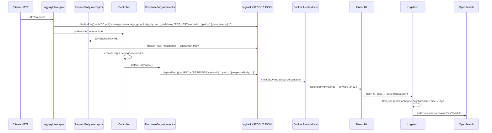

# Fluxo de Logs

## Do Request HTTP ao Documento no OpenSearch

---

## Por que o log de REQUEST aparece duas vezes

`LoggingInterceptor.preHandle()` chama `displayReq()` **antes** do corpo da requisição ser desserializado (sem `body`). Se o endpoint tiver `@RequestBody`, o `RequestBodyInterceptor` (`@ControllerAdvice` global) chama `displayReq()` de novo, agora **com** o `body` já lido. Em endpoints sem `@RequestBody` (ex.: `GET /pessoa/{id}`), o log de request aparece só uma vez, sem body.

| Componente | Quando executa | O que loga |
|---|---|---|
| `LoggingInterceptor` (`HandlerInterceptor.preHandle`) | Antes do controller, sempre | `REQUEST` sem body |
| `RequestBodyInterceptor` (`RequestBodyAdviceAdapter.afterBodyRead`) | Só em endpoints com `@RequestBody`, após desserializar | `REQUEST` com body |
| `ResponseBodyInterceptor` (`ResponseBodyAdvice.beforeBodyWrite`) | Antes de serializar a resposta, sempre | `RESPONSE` com headers + body |

Todos os três chamam `getMDC()` internamente, que faz `MDC.clear()` e repopula os campos a cada chamada — não há acúmulo de contexto entre requests.

---

## Campos MDC propagados para o log JSON

| Campo MDC | Origem | Exemplo |
|---|---|---|
| `nameApp` | `project.properties` → `@project.name@` (Maven resource filtering) | `ms-obs` |
| `versaoApp` | `@project.version@` | `1.0-SNAPSHOT` |
| `groupIdApp` | `@project.groupId@` | `br.com.ms` |
| `ip` | `request.getRemoteAddr()+":"+getRemotePort()+":"+getProtocol()` | `172.18.0.1:54212:HTTP/1.1` |
| `verb` | `request.getMethod()` | `POST` |
| `path` | `request.getRequestURI()` | `/pessoa` |

No Logstash, o filtro `mutate { rename => {"mdc" => "app"} }` renomeia o objeto MDC recebido para o campo `app` no documento indexado — mantendo o payload de log (`log` / `http`) e o contexto da aplicação (`app`) separados no OpenSearch.
