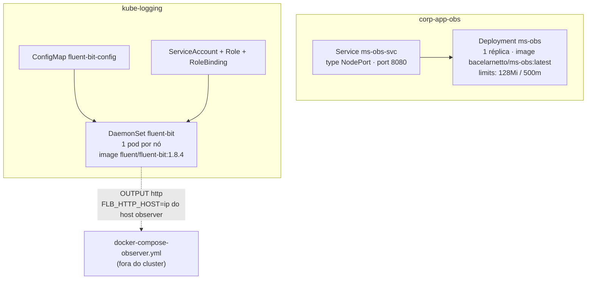

# Kubernetes

## Topologia de Namespaces



## `kubernetes/app/` — o microsserviço

| Arquivo | Recurso |
|---|---|
| `sboot-app-namespace.yaml` | Namespace `corp-app-obs` |
| `sboot-app.yaml` | Deployment `ms-obs` — 1 réplica, `limits: memory 128Mi / cpu 500m`, container port `8080` |
| `sboot-app-svc.yaml` | Service `ms-obs-svc` — `type: NodePort`, expõe a porta `8080` |

```bash
kubectl apply -f kubernetes/app/sboot-app-namespace.yaml
kubectl apply -f kubernetes/app/sboot-app.yaml
kubectl apply -f kubernetes/app/sboot-app-svc.yaml
```

> Não há liveness/readiness probe configurada no Deployment do `ms-obs` — diferente do DaemonSet do Fluent Bit, que tem ambas via `httpGet` na porta `2020`.

## `kubernetes/infra/` e `kubernetes/infra-no-pv/` — coleta de logs

Ver detalhamento completo em [Fluent Bit](fluent-bit). Resumo do que cada script de deploy cria, na ordem:

1. Namespace `kube-logging`
2. `ServiceAccount` + `Role` + `RoleBinding` (permissão para o Fluent Bit ler metadados de pods via API do Kubernetes — necessário para o `FILTER kubernetes`)
3. `ConfigMap fluent-bit-config` (arquivo `fluent-bit.conf` + `parsers.conf` + `custom_parsers.conf` embutidos)
4. `DaemonSet fluent-bit`
5. `Service` (expõe a porta `2020` de métricas/health do Fluent Bit)

```bash
cd kubernetes/infra-no-pv    # ou kubernetes/infra
./deploy-fluent-bit.sh
# ...
./undeploy-fluent-bit.sh
```

## `kubernetes/helm.yaml`

Arquivo solto na raiz de `kubernetes/` — manifesto avulso, não associado a um chart Helm específico dos dois em `kubernetes/helm/`.

## `kubernetes/helm/` — charts

| Chart | Status |
|---|---|
| `fluent-bit-helm/` | Scaffold padrão do `helm create` — ainda não customizado com o pipeline INPUT/FILTER/OUTPUT deste projeto (ver [Fluent Bit](fluent-bit)) |
| `nginxhelm/` | Chart mínimo (`Chart.yaml` + `deployment.yaml` + `values.yaml`) — sem relação direta com o pipeline de logs; aparenta ser um exemplo/exercício de Helm à parte |
