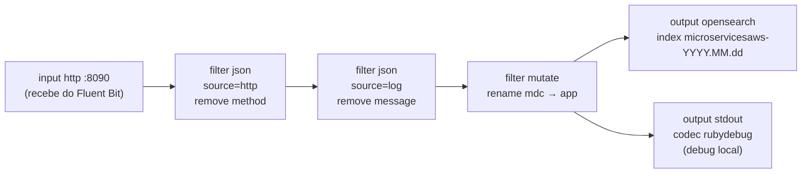

# Logstash + OpenSearch

## Pipeline (`logstash/pipeline/logstash.conf`)

```ini
input {
  http {
    port => 8090
    host => "0.0.0.0"
  }
}

filter {
  json {
    source => "http"
    remove_field => [ "method" ]
  }
  json {
    source => "log"
    remove_field => ["message"]
  }
  mutate {
    rename => {"mdc" => "app"}
  }
}

output {
  opensearch {
    hosts => ["http://opensearch-node1:9200"]
    index => "microservicesaws-%{+yyyy.MM.dd}"
  }
  stdout {
    codec => rubydebug
  }
}
```



### O que cada filtro faz

| Etapa | Efeito |
|---|---|
| `json { source => "http" }` | O evento recebido do Fluent Bit chega com o payload HTTP bruto no campo `http`; este filtro parseia esse campo como JSON, promovendo suas chaves ao nível raiz do evento. `remove_field => ["method"]` descarta o método HTTP do envelope de transporte (não confundir com o `verb` do MDC da aplicação). |
| `json { source => "log" }` | O conteúdo do log em si (a linha JSON gerada pelo `JsonLayout` do logback) chega no campo `log`; este filtro o parseia, expondo `message`, `level`, `mdc`, etc. `remove_field => ["message"]` remove a mensagem de texto livre já capturada de forma estruturada. |
| `mutate { rename => {"mdc" => "app"} }` | Renomeia o objeto de contexto MDC (`nameApp`, `versaoApp`, `groupIdApp`, `ip`, `verb`, `path` — ver [Fluxo de Logs](fluxo-logs)) para `app`, deixando claro no documento indexado que aquele bloco é metadado da aplicação, não do log em si. |

- `input.beats` (porta `5044`) e `input.tcp` (porta `5000`) estão comentados no arquivo — vestígios de configurações alternativas já testadas, não usados atualmente.
- `stdout { codec => rubydebug }` mantém uma cópia legível de cada evento no log do container `logstash-node1`, útil para depurar o pipeline sem precisar consultar o OpenSearch.

---

## Índice no OpenSearch

- Padrão de nome: `microservicesaws-%{+yyyy.MM.dd}` — um índice novo por dia (ex.: `microservicesaws-2026.08.23`).
- Output plugin: `opensearchproject/logstash-oss-with-opensearch-output-plugin`, que adiciona o output `opensearch` (não disponível no Logstash OSS puro).
- Para explorar os dados no **OpenSearch Dashboards**: criar um *index pattern* `microservicesaws-*` e usar a aba **Discover**.

```bash
# Consulta direta via REST API, sem dashboard
curl -s "http://localhost:9200/microservicesaws-*/_search?pretty&size=5"
```

## `logstash/config/logstash.yml`

Configuração de runtime do Logstash (paths de pipeline, configurações de monitoramento). Montada no container via volume, junto com o `logstash.conf` — qualquer mudança em ambos os arquivos exige `docker-compose restart logstash` (ou `up -d --force-recreate`) para ter efeito, já que não há hot-reload configurado.
