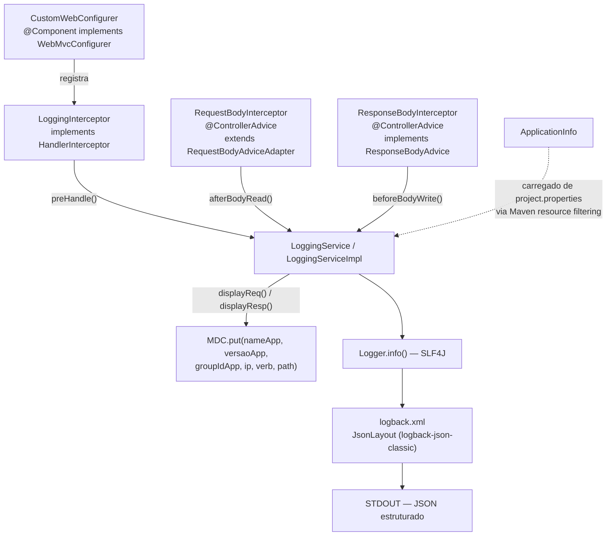

# Microsserviço ms-obs

API de teste em **Spring Boot 2.2.1 / Java 11**, usada como fonte de logs para validar o pipeline de observabilidade. Persistência em **H2 em memória** — os dados não sobrevivem a um restart, de propósito, já que o foco do projeto é o log, não o domínio de negócio.

## Estrutura de Pacotes

```
br.com.ms/
├── controller/          ← @RestController (PessoaController, EnderecoController)
├── service/              ← regras de negócio (PessoaService, EnderecoService)
├── model/entity/         ← @Entity JPA (Pessoa, Endereco)
├── dto/                  ← PessoaDTO, PessoaNewDTO
├── repository/           ← PessoaRepository (Spring Data JPA)
├── validation/           ← Bean Validation customizada (Pessoa Insert/Update)
├── exception/            ← exceções de domínio + handler global
├── message/              ← StandardError, ValidationError, FieldMessage
├── config/               ← SwaggerConfig (springfox)
└── custom/loggers/       ← toda a infraestrutura de logging estruturado
```

---

## Pacote `custom.loggers` — o coração da observabilidade



| Classe | Papel |
|---|---|
| `CustomWebConfigurer` | Registra o `LoggingInterceptor` no `InterceptorRegistry` do Spring MVC |
| `LoggingInterceptor` | `HandlerInterceptor.preHandle()` — loga a requisição antes do controller rodar |
| `RequestBodyInterceptor` | `@ControllerAdvice` global — loga a requisição de novo, agora com o `@RequestBody` desserializado |
| `ResponseBodyInterceptor` | `@ControllerAdvice` global — loga a resposta antes de ser serializada |
| `LoggingService` / `LoggingServiceImpl` | Monta as strings `REQUEST ...` / `RESPONSE ...` e popula o MDC |
| `ApplicationInfo` | DTO simples (Lombok) com `name`, `version`, `groupId` lidos de `project.properties` |
| `EnableLoggingConfigurations` | Anotação declarada mas **não implementada** (`@Retention`/`@Target`/`@Import` comentados) — hoje é um marcador sem efeito |

> Ver o passo a passo completo de uma requisição em [Fluxo de Logs](fluxo-logs).

---

## logback.xml

```xml
<appender name="STDOUT-JSON" class="ch.qos.logback.core.ConsoleAppender">
    <layout class="ch.qos.logback.contrib.json.classic.JsonLayout">
        <jsonFormatter class="ch.qos.logback.contrib.jackson.JacksonJsonFormatter" />
        <timestampFormat>yyyy-MM-dd'T'HH:mm:ss.SSS'Z'</timestampFormat>
    </layout>
</appender>
```

- Dependências: `logback-json-classic` + `logback-jackson` (0.1.5).
- Nível de log configurável via variável de ambiente `LOG_LEVEL` (default `INFO`).
- Não existe appender de rede — o encaminhamento para Fluent Bit acontece **fora** da JVM, via `logging.driver: fluentd` no `docker-compose.yml`.

---

## Endpoints REST

| Método | Path | Controller | Descrição |
|---|---|---|---|
| `POST` | `/pessoa` | `PessoaController` | Cadastra uma Pessoa (`PessoaNewDTO`) — retorna `201` com `Location` |
| `PUT` | `/pessoa/{id}` | `PessoaController` | Atualiza uma Pessoa (`PessoaDTO`) — retorna `204` |
| `DELETE` | `/pessoa/{id}` | `PessoaController` | Remove uma Pessoa — retorna `204` |
| `GET` | `/pessoa/{id}` | `PessoaController` | Busca uma Pessoa por id |
| `GET` | `/pessoa` | `PessoaController` | Lista todas as Pessoas |
| `GET` | `/endereco` | `EnderecoController` | Lista endereços — **dados fixos em memória** (`EnderecoService`, sem persistência) |

Documentação interativa via Swagger/OpenAPI (springfox 2.9.2) — `SwaggerConfig` expõe a UI padrão em `/swagger-ui.html` quando a aplicação está no ar.

Requisições de exemplo prontas em [`rest-client/pessoa.http`](../../rest-client/pessoa.http) e [`rest-client/endereco.http`](../../rest-client/endereco.http) (formato `.http`, compatível com o REST Client do VS Code / IntelliJ HTTP Client).

---

## Build e Execução

```bash
cd ms-obs
./mvnw clean package
docker build -t bacelarnetto/ms-obs:latest .
```

`Dockerfile` roda em `openjdk:11`, copia o jar de `target/*.jar` e sobe com `java -jar app.jar`. `server.port` é configurável via variável de ambiente `port` (default `8080`).
