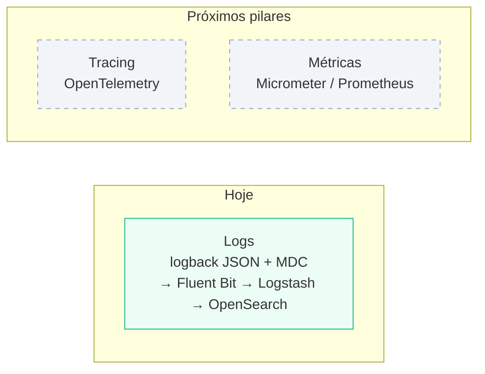

# Próximos Passos

O projeto hoje cobre apenas um dos três pilares de observabilidade: **logs**. Não há instrumentação de **tracing** distribuído nem de **métricas** — nenhuma dependência de OpenTelemetry, Zipkin, Jaeger, Micrometer ou Prometheus no `pom.xml` ou no código do `ms-obs`.

## Tracing com OpenTelemetry

### Onde encaixaria

- **OpenTelemetry Java agent** anexado ao `ms-obs` (`-javaagent:opentelemetry-javaagent.jar`), sem precisar reescrever os controllers — instrumenta Spring MVC automaticamente e gera um span por requisição.
- **Correlação log ↔ trace**: hoje o `LoggingServiceImpl.getMDC()` já popula o MDC com `nameApp`, `versaoApp`, `groupIdApp`, `ip`, `verb`, `path` (ver [Fluxo de Logs](fluxo-logs)). Bastaria adicionar `traceId` e `spanId` ali — o OpenTelemetry Java agent expõe esses valores via `Span.current().getSpanContext()` — para que cada linha de log JSON já saia com o id do trace correspondente, permitindo pular de um log no OpenSearch Dashboards direto para o trace equivalente em um backend de tracing.
- **Exportador**: um `OTel Collector` (ou diretamente um backend como Jaeger/Tempo) precisaria ser adicionado ao `docker-compose.yml`, recebendo os spans via OTLP.

### Limitação atual

O maior valor do tracing distribuído aparece quando uma requisição atravessa **múltiplos serviços** — cada um contribui um span, e a ferramenta de tracing reconstrói a árvore de chamadas completa. Hoje o projeto tem só o `ms-obs` como serviço único; instrumentá-lo sozinho ainda ajuda (visualizar tempo gasto em cada camada interna, correlacionar log↔trace), mas o ganho real de "rastrear uma requisição atravessando N serviços" só se materializa se um segundo microsserviço for adicionado ao projeto para simular uma chamada entre serviços.

### Passos sugeridos, em ordem

1. Adicionar um segundo microsserviço de exemplo que o `ms-obs` chame via HTTP (para haver algo de fato distribuído a rastrear).
2. Anexar o OpenTelemetry Java agent a ambos os serviços.
3. Adicionar `traceId`/`spanId` ao MDC em `LoggingServiceImpl.getMDC()`.
4. Subir um `OTel Collector` + backend de tracing (Jaeger ou Tempo) no `docker-compose.yml`.
5. Validar a correlação: buscar um log no OpenSearch Dashboards, pegar o `traceId`, e localizar o mesmo trace no backend de tracing.

## Métricas

Não avaliado em detalhe ainda, mas seguiria o padrão usual em Spring Boot: `micrometer-registry-prometheus` expondo `/actuator/prometheus`, com um Prometheus + Grafana adicionados ao `docker-compose.yml` para completar os três pilares (logs, traces, métricas) no mesmo projeto de estudo.
